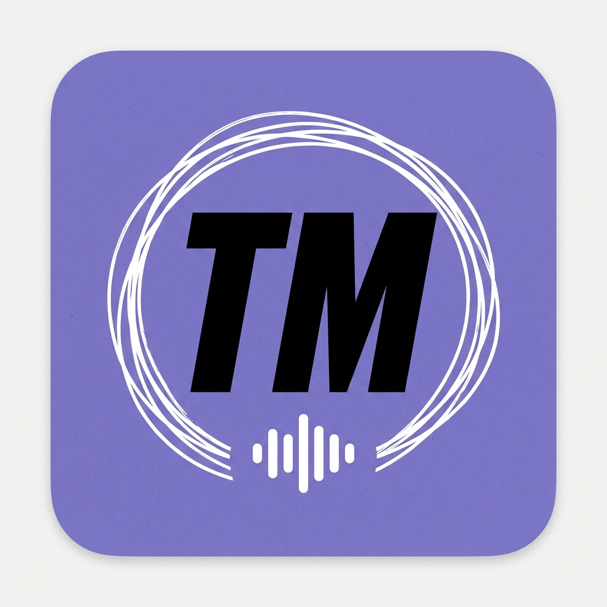

🌐 [Русский](translations/ru/README.md) | [中文](translations/zh/README.md)

# TvoyMeet

Local audio and video transcription. No cloud. No subscriptions.



## Features

- Drag & drop a file or paste a link (YouTube, VK, Rutube, etc.)
- Extract audio via FFmpeg with time-based trimming
- Transcribe locally with Whisper (models from tiny to large-v3)
- Export to txt, json, srt, vtt, tsv
- Generate a `.md` file with transcript and LLM-ready prompt

## Download

See [Releases](../../releases) for prebuilt binaries:

- `TvoyMeet-mac.zip` — macOS app
- `TvoyMeetInstaller.exe` — Windows installer

### First launch on macOS

macOS blocks unsigned apps. Two ways to bypass:

**Option 1 — Terminal** (recommended):
```bash
xattr -cr ~/Downloads/TvoyMeet.app
open ~/Downloads/TvoyMeet.app
```

**Option 2 — Finder**:
Right-click `TvoyMeet.app` → **Open** → **Open** in the dialog.

## Run from source

```bash
git clone https://github.com/umyarr/tvoymeet
cd tvoymeet
python -m venv .venv
# Windows:
.venv\Scripts\activate.bat
# Mac/Linux:
source .venv/bin/activate

pip install -r requirements.txt
python transcriber.py
```

FFmpeg must be installed or placed next to `transcriber.py`.

## Stack

- [customtkinter](https://github.com/TomSchimansky/CustomTkinter) — UI
- [faster-whisper](https://github.com/SYSTRAN/faster-whisper) — transcription
- [tkinterdnd2](https://github.com/pmgagne/tkinterdnd2) — drag & drop (Windows only)
- [yt-dlp](https://github.com/yt-dlp/yt-dlp) — download from URL
- PyInstaller — build to .exe / .app
